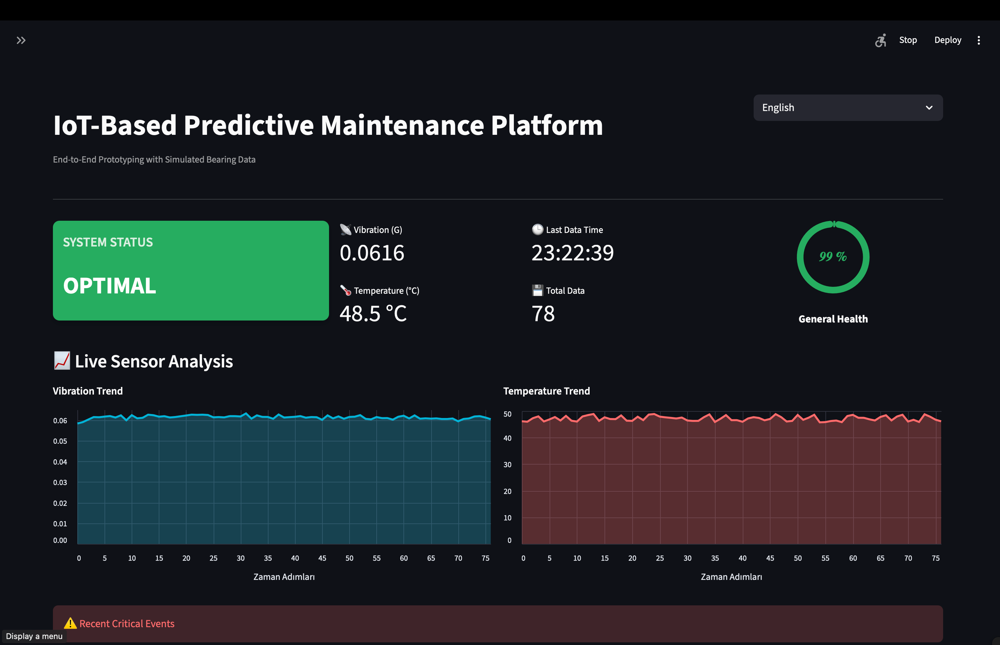
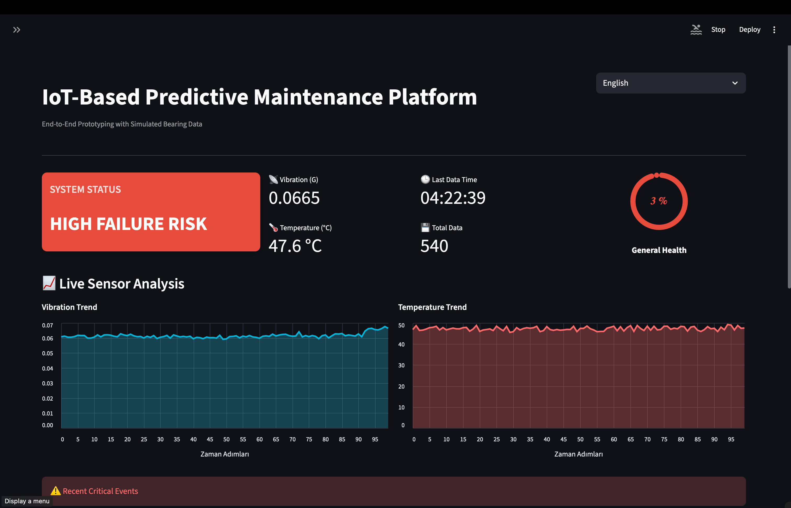
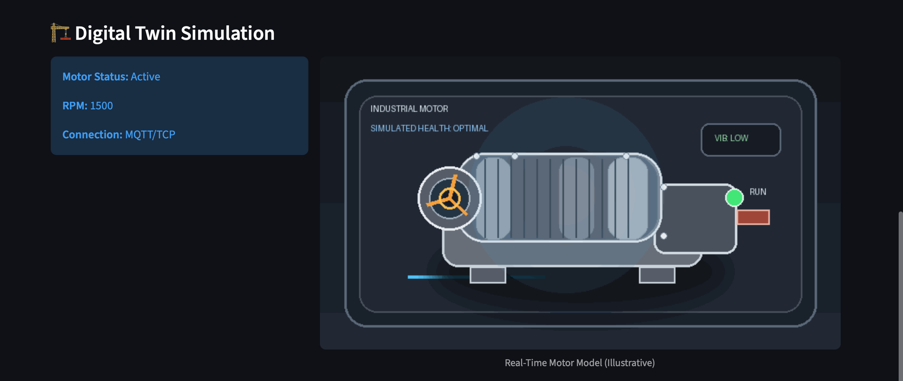
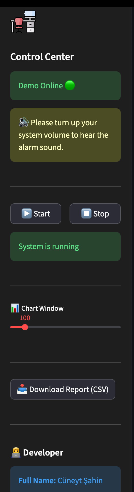
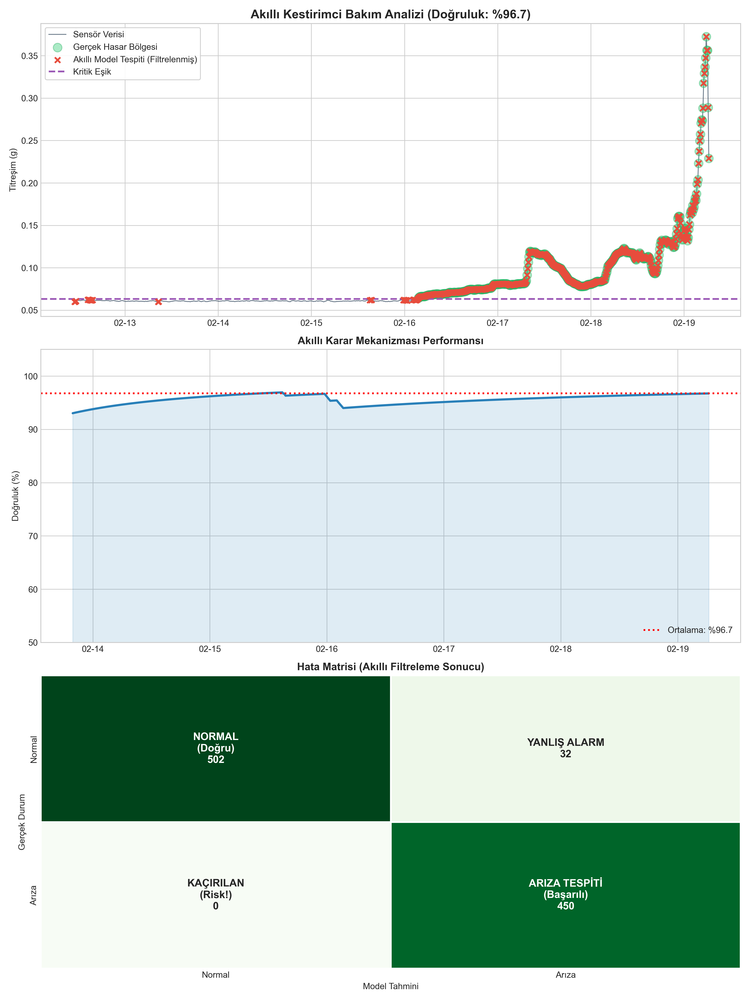

# 🏭 IoT-Based Predictive Maintenance Platform


> ### 🔴 [CLICK HERE FOR LIVE DEMO](https://your-app-link.streamlit.app)
> *Experience the real-time predictive maintenance simulation directly in your browser without installation.*

---

### ⚠️ Important Note Regarding the Dataset (NASA Bearing Dataset)
This project utilizes the industry-standard **[NASA IMS Bearing Dataset](https://www.kaggle.com/datasets/vinayak123tyagi/bearing-dataset)**.

* **Selected Data:** Specifically **Test Set No. 2**.
* **Rationale:** This is a "Run-to-Failure" experiment where four bearings were operated for 7 days until **Bearing 1** suffered an **Outer Race Failure**.
* **Preprocessing:** The original high-frequency vibration signals (20 kHz) were processed to extract meaningful features (Mean Absolute Value) for IoT transmission.

---

**IoT Predictive Maintenance Platform** is an end-to-end solution that monitors the health status of industrial rotating machinery in real-time. It manages data flow via the **MQTT** protocol and detects potential failures before they occur using **Artificial Intelligence (Isolation Forest)**. It also features a **Digital Twin** simulation to visualize the physical state in a virtual environment.

## 📸 Dashboard Preview


*General view when the system is operating healthily (Optimum State).*


*The "High Failure Risk" screen triggered when the AI detects an anomaly.*


*Digital Twin area visualizing the real-time status of the motor.*

*You can resize the x-axis dimension of the graph to your desired size or download the processed data as a CSV file.*

## 🧾 Offline Report Preview


*Generated via `report_output.py`.*
---

## 🚀 Key Features

* **📡 Real-Time MQTT Streaming:** Sensor data is simulated live via the HiveMQ broker and streamed to the dashboard.
* **🧠 Hybrid Decision Engine:** Combines the `Isolation Forest` AI model with statistical rules to minimize False Positives.
* **🔊 Audible & Visual Alarms:** The system alerts the operator with both visual cues and an **Audio Alarm** when critical thresholds are exceeded.
* **🏗️ Digital Twin:** The interface features a 3D/GIF simulation displaying the physical motor status, RPM, and connection state.
* **🛡️ History Buffer:** Decisions are based on the average of the last 5 data points to prevent instability caused by momentary spikes.
* **📂 Reporting:** Processed data and analysis results can be downloaded instantly as CSV files.

---

## 🛠️ Tech Stack

* **Core:** Python 3.10+
* **UI/UX:** Streamlit, Custom CSS
* **Communication:** Paho MQTT (Publisher/Subscriber Architecture)
* **Machine Learning:** Scikit-learn (Isolation Forest)
* **Visualization:** Altair, Pandas
* **Data Source:** NASA IMS Bearing Data (Kaggle)

---

## 📂 Project Structure

```bash
IOT_PROJECT/
├── REAL_IOT_SYSTEM/      # 🔴 Local (MQTT) system
│   ├── subscriber.py     # (BRAIN) MQTT listener, AI Model, and Decision Logic
│   ├── publisher.py      # (SENSOR) Simulates raw data and publishes to MQTT
│   └── dashboard.py      # (UI) Streamlit dashboard (MQTT)
├── DEMO_SYSTEM/          # 🟢 Cloud demo (CSV only)
│   └── app_demo.py       # Streamlit demo app (CSV playback)
├── SHARED_FILES/         # 📄 Shared files
│   ├── sensor_data.csv   # Shared dataset
│   ├── alarm.wav         # Audio alert
│   ├── model.pkl         # Trained model
│   ├── report.png        # Offline report image
│   └── requirements.txt  # Dependencies
├── prepare_data.py       # Tool to process NASA data into CSV
├── report_output.py      # Offline performance analysis and graph generation
└── images/               # UI screenshots and assets
```

## ⚡ Getting Started
Follow these steps to run the project locally:

### 1) Clone the Repository

```bash
git clone https://github.com/username/project-name.git
cd project-name
```

### 2) Install Dependencies

```bash
pip install -r SHARED_FILES/requirements.txt
```

### 3) Run the Local (MQTT) System
To fully simulate the architecture, open 3 separate terminals and run the commands in this specific order:

**Terminal 1 (Analysis Engine):**

```bash
python REAL_IOT_SYSTEM/subscriber.py
```

**Terminal 2 (Data Stream):**

```bash
python REAL_IOT_SYSTEM/publisher.py
```

**Terminal 3 (User Interface):**

```bash
streamlit run REAL_IOT_SYSTEM/dashboard.py
```

### 4) Run the Demo (Cloud) System
This version reads directly from `sensor_data.csv` and does not use MQTT:

```bash
streamlit run DEMO_SYSTEM/app_demo.py
```

---

## 📊 Model Performance
The model demonstrated high success rates in retrospective tests performed on the NASA dataset.

**Accuracy:** 96.7%

**True Positives (Detected Failures):** 450

**False Negatives (Missed Failures):** 0
## 👨‍💻 Author
Cüneyt Şahin

[LinkedIn Profile](https://www.linkedin.com/in/cuneyt-sahin)

[GitHub Profile](https://github.com/Cuneyt-Sahin)